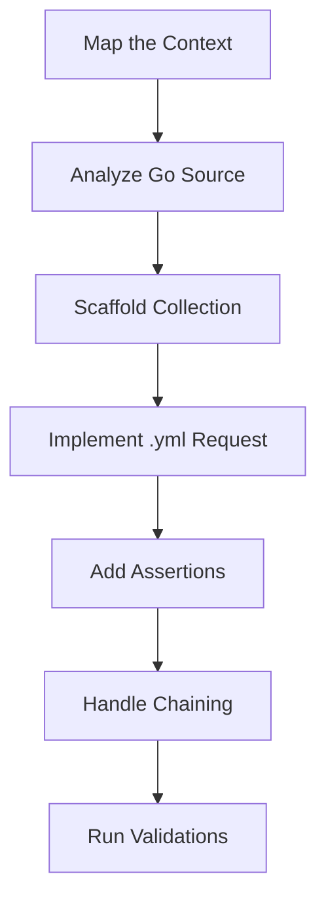

# E2E Endpoint Tester (Bruno)

This skill enables automated E2E testing for RESTful APIs using **Bruno**, a fast and Git-friendly API client. It supports both the native `.bru` DSL and the **OpenCollection YAML (.yml)** format, with a preference for `.yml` in this repository.

## E2E Testing Workflow



## 🚀 When to Activate

Activate this skill when:
- A new API endpoint is created and needs validation.
- An existing endpoint requires regression testing.
- You need to automate complex API workflows (request chaining).
- You are debugging API responses and want to save the test cases for the future.

## 📁 Collection Architecture & Organization

To maintain clarity and scalability, follow this hierarchical structure within the `bruno/` directory:

1. **Root Directory**: All collections reside in the root `bruno/` directory.
2. **Service Isolation**: Group collections by service: `bruno/<service_name>/`.
3. **Context Isolation**: Create a separate directory/collection for **each domain context**: `bruno/<service_name>/<context>/`.
4. **Essential Files**: Each context collection folder MUST contain:
    - `bruno.json`: Defines the collection name (e.g., `{"version": "1", "name": "Service - Context", "type": "collection"}`).
    - `environments/dev.bru`: Defines variables like `baseUrl`.

## 🔍 Sourcing Truth for Implementation

When creating endpoints, always analyze these files in the corresponding service:
- **Routes**: `internal/app/routes.go` or `internal/*/handler.go` to identify methods, paths, and handler mapping.
- **DTOs**: `internal/*/dto.go` to understand the request body structure (`Create...Request`) and expected response fields.

## 📄 Supported Syntax Formats

### 1. YAML Format (.yml) - Preferred
Used for standard requests within the project. It follows the OpenCollection spec.

```yaml
info:
  name: CreateUser
  type: http
  seq: 1
http:
  method: POST
  url: "{{baseUrl}}/users"
  body:
    type: json
    data: |-
      {
        "username": "tester"
      }
tests: |-
  test("should return 201", function() {
    expect(res.getStatus()).to.equal(201);
  });
```

### 2. Bruno DSL (.bru)
Organized into blocks for easier manual editing.

```bash
post {
  url: {{baseUrl}}/users
}

body:json {
  { "username": "tester" }
}

tests {
  test("Status 201", () => expect(res.status).to.equal(201));
}
```

## 🛠 Standard Workflow

1. **Map the Context**: Identify service and domain (e.g., `communication/messages`).
2. **Analyze Source**: Read Go handlers and DTOs to extract path, method, and payload.
3. **Scaffold**: Ensure `bruno.json` exists in the context folder.
4. **Implement Request**: Create `.yml` file with `info`, `http`, and `body` blocks.
5. **Add Assertions**: Use `tests` block with Chai.js.
6. **Handle Dependencies**: Use `script:post-response` to capture IDs for subsequent requests (`bru.setVar("id", res.body.id)`).

## 🧪 Advanced Testing Patterns

### Request Chaining
```javascript
// Post-response script to save ID for next request
bru.setVar("createdId", res.body.id);
```

### Dynamic Data
Use `{{$guid}}`, `{{$timestamp}}`, or `{{$randomInt}}` for unique request data.

### Schema Validation
```javascript
test("Body contains ID", () => {
  const data = res.getBody();
  expect(data).to.have.property("id");
});
```