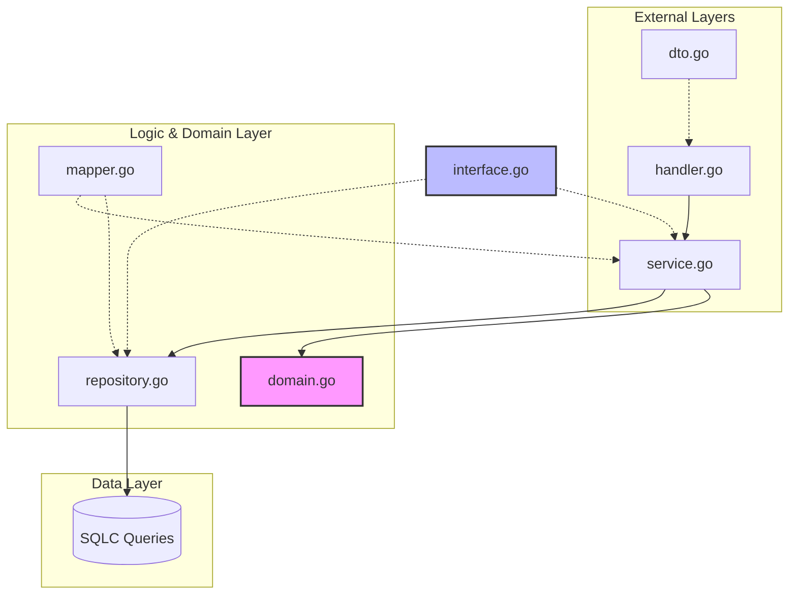

# Go Backend Architect

Generates and enforces a consistent 7-layer architecture for Go REST API backends. Every bounded context lives in `pkg/{context}/` and follows the same file structure.

## Architectural Visualization



## The 7-Layer Structure

Generate files in this exact order — each layer only depends on layers above it:

```text
pkg/{context}/
├── domain.go      (1) Pure domain structs — NO external imports
├── dto.go         (2) HTTP request/response structs + swaggo annotations
├── interface.go   (3) Repository and Service interface definitions
├── repository.go  (4) DB implementation — wraps sqlc generated queries
├── mapper.go      (5) Converts sqlc models ↔ domain structs
├── service.go     (6) Business logic — calls Repository interface
└── handler.go     (7) HTTP handlers — calls Service interface
```

## Hard Rules — Never Violate

| Rule | Why |
| :--- | :--- |
| `domain.go` NEVER imports sqlc models or `database/sql` | Domain must stay portable and testable |
| `handler.go` NEVER imports `repository.go` directly | Always via Service interface |
| `service.go` NEVER imports `handler.go` | No upward dependencies |
| All errors: `fmt.Errorf("{context}.{method}: %w", err)` | Consistent stack traces |
| All HTTP responses via `internal/respond` helpers | Never `json.NewEncoder` in handlers |
| No `init()` functions anywhere | Explicit wiring only |
| No global state / package-level vars (except sentinel errors) | Testability |
| No `panic()` anywhere in the codebase | Graceful error handling only |

---

## File Templates

### 1. domain.go
```go
package {context}

import "time"

// {Entity} is the core domain model. No external dependencies.
type {Entity} struct {
    ID        string
    // ... fields from FEATURES.md entity definition
    CreatedAt time.Time
    UpdatedAt time.Time
    DeletedAt *time.Time // only if soft-deletable
}

// Sentinel errors — map to HTTP status codes in handler
var (
    Err{Entity}NotFound     = errors.New("{context}: not found")
    Err{Entity}Conflict     = errors.New("{context}: already exists")
    ErrInvalidStatusChange  = errors.New("{context}: invalid status transition")
)
```

### 2. dto.go
```go
package {context}

// Create{Entity}Request maps to POST /{entities}
// @Description Request body for creating a {entity}
type Create{Entity}Request struct {
    Name string `json:"name" validate:"required,min=1,max=255"`
    // ... fields from FEATURES.md endpoints
}

// {Entity}Response is the public API representation
type {Entity}Response struct {
    ID        string `json:"id"`
    // ... all public fields
    CreatedAt string `json:"created_at"` // ISO 8601 string
}

// {Entity}ListResponse wraps paginated results
type {Entity}ListResponse struct {
    Items      []{Entity}Response `json:"items"`
    TotalCount int                `json:"total_count"`
    Page       int                `json:"page"`
    PageSize   int                `json:"page_size"`
}
```

### 3. interface.go
```go
package {context}

import "context"

type {Entity}Repository interface {
    GetByID(ctx context.Context, id string) (*{Entity}, error)
    List(ctx context.Context, params List{Entity}Params) ([]{Entity}, int, error)
    Create(ctx context.Context, input Create{Entity}Input) (*{Entity}, error)
    Update(ctx context.Context, id string, input Update{Entity}Input) (*{Entity}, error)
    SoftDelete(ctx context.Context, id string) error
}

type {Entity}Service interface {
    Get{Entity}(ctx context.Context, id string) (*{Entity}Response, error)
    List{Entity}s(ctx context.Context, params List{Entity}Params) (*{Entity}ListResponse, error)
    Create{Entity}(ctx context.Context, req Create{Entity}Request) (*{Entity}Response, error)
    Update{Entity}(ctx context.Context, id string, req Update{Entity}Request) (*{Entity}Response, error)
    Delete{Entity}(ctx context.Context, id string) error
}
```

### 4. repository.go
```go
package {context}

import (
    "context"
    "database/sql"
    "errors"
    "fmt"
    "github.com/{org}/{repo}/db/sqlc"
)

type {entity}Repository struct {
    db *sqlc.Queries
}

func New{Entity}Repository(db *sql.DB) {Entity}Repository {
    return &{entity}Repository{db: sqlc.New(db)}
}

func (r *{entity}Repository) GetByID(ctx context.Context, id string) (*{Entity}, error) {
    row, err := r.db.Get{Entity}ByID(ctx, id)
    if err != nil {
        if errors.Is(err, sql.ErrNoRows) {
            return nil, Err{Entity}NotFound
        }
        return nil, fmt.Errorf("{context}.GetByID: %w", err)
    }
    return map{Entity}FromDB(row), nil
}
```

### 5. mapper.go
```go
package {context}

import "github.com/{org}/{repo}/db/sqlc"

// map{Entity}FromDB converts a sqlc model to a domain struct.
// This is the ONLY place sqlc models are referenced in this package.
func map{Entity}FromDB(row sqlc.{Entity}) *{Entity} {
    return &{Entity}{
        ID:        row.ID.String(),
        // ... map all fields
        CreatedAt: row.CreatedAt.Time,
    }
}

// {Entity}ToResponse converts a domain struct to an API response DTO.
func {entity}ToResponse(e *{Entity}) {Entity}Response {
    return {Entity}Response{
        ID:        e.ID,
        // ... map all fields
        CreatedAt: e.CreatedAt.Format(time.RFC3339),
    }
}
```

### 6. service.go
```go
package {context}

import (
    "context"
    "fmt"
)

type {entity}Service struct {
    repo {Entity}Repository
}

func New{Entity}Service(repo {Entity}Repository) {Entity}Service {
    return &{entity}Service{repo: repo}
}

func (s *{entity}Service) Get{Entity}(ctx context.Context, id string) (*{Entity}Response, error) {
    entity, err := s.repo.GetByID(ctx, id)
    if err != nil {
        return nil, fmt.Errorf("{context}.Get{Entity}: %w", err)
    }
    res := {entity}ToResponse(entity)
    return &res, nil
}
```

### 7. handler.go
```go
package {context}

import (
    "net/http"
    "github.com/{org}/{repo}/internal/respond"
)

type {Entity}Handler struct {
    svc {Entity}Service
}

func New{Entity}Handler(svc {Entity}Service) *{Entity}Handler {
    return &{Entity}Handler{svc: svc}
}

func (h *{Entity}Handler) HandleGet{Entity}(w http.ResponseWriter, r *http.Request) {
    id := r.PathValue("id") // Go 1.22+ stdlib routing
    res, err := h.svc.Get{Entity}(r.Context(), id)
    if err != nil {
        switch {
        case errors.Is(err, Err{Entity}NotFound):
            respond.NotFound(w, err)
        default:
            respond.InternalError(w, err)
        }
        return
    }
    respond.JSON(w, http.StatusOK, res)
}
```

---

## internal/respond — Response Helpers

These must exist in `internal/respond/`. Always use them — never write raw `json.Encode` in handlers.

```go
respond.JSON(w, http.StatusOK, payload)   // generic JSON response
respond.Created(w, payload)               // 201
respond.NoContent(w)                      // 204
respond.BadRequest(w, err)                // 400
respond.Unauthorized(w)                   // 401
respond.Forbidden(w)                      // 403
respond.NotFound(w, err)                  // 404
respond.Conflict(w, err)                  // 409
respond.InternalError(w, err)             // 500
respond.DecodeJSON(r, &target)            // decode + validate request body
```

## Naming Conventions

| Element | Pattern | Example |
| :--- | :--- | :--- |
| Interface | `{Name}Repository`, `{Name}Service` | `ProductRepository` |
| Constructor | `New{Name}{Type}(...)` | `NewProductService(repo)` |
| Handler method | `Handle{Verb}{Resource}` | `HandleCreateProduct` |
| Create DTO | `Create{Resource}Request` | `CreateProductRequest` |
| Update DTO | `Update{Resource}Request` | `UpdateProductRequest` |
| Response DTO | `{Resource}Response` | `ProductResponse` |
| List response | `{Resource}ListResponse` | `ProductListResponse` |
| Sentinel error | `Err{Resource}{Reason}` | `ErrProductNotFound` |

## Wiring in main.go / router.go

```go
// Dependency injection — always explicit, never magic
productRepo := product.NewProductRepository(db)
productSvc  := product.NewProductService(productRepo)
productHdlr := product.NewProductHandler(productSvc)

// Route registration (Go 1.22+ stdlib)
mux.HandleFunc("GET /products",         productHdlr.HandleListProducts)
mux.HandleFunc("GET /products/{slug}", productHdlr.HandleGetProduct)
mux.HandleFunc("POST /products",       mid.RequireAdmin(productHdlr.HandleCreateProduct))
mux.HandleFunc("PUT /products/{id}",   mid.RequireAdmin(productHdlr.HandleUpdateProduct))
mux.HandleFunc("DELETE /products/{id}", mid.RequireAdmin(productHdlr.HandleDeleteProduct))
```

## Verification Gates

Run after generating any Go code:
```bash
go build ./...            # must compile cleanly
go vet ./...              # must pass
golangci-lint run ./...   # must pass (if configured)
go test ./...             # run after wiring
```

## Common Patterns Reference

See `references/patterns.md` for extended examples of:
- Pagination helpers
- Soft delete query patterns
- Status transition validation
- Audit log / event appending