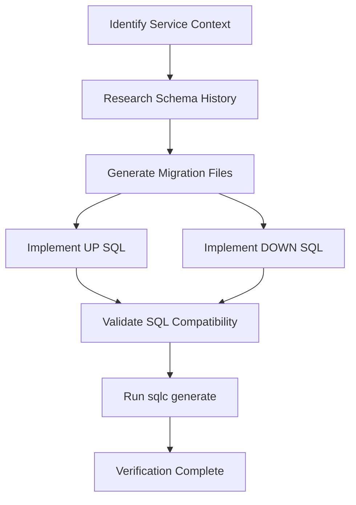

# Database Migrator

Expert in PostgreSQL and standard microservice migration patterns. This skill ensures that all database changes are tracked, rollback-ready, and synchronized with existing schema history.

## Activation Criteria

- When the user asks to **'create a migration'**, **'add a table'**, or **'modify a database schema'**.
- When a new feature requires database persistence.
- When you need to **'delete'** (rollback) a database change.

## Migration Flow



## Execution Workflow

Follow these steps strictly:

### 1. Service Context Detection
- Identify the target service (e.g., `services/communication`) from the user request or current active files.
- Locate the `sql/migrations/` directory within the service root to confirm the project structure.
- **CHECK ENCODING**: If files like `Makefile` appear empty but have size, check if they are UTF-16. Convert to UTF-8 if necessary:
  ```bash
  iconv -f UTF-16 -t UTF-8 Makefile > Makefile.tmp && mv Makefile.tmp Makefile
  ```

### 2. Schema History Research
- **MANDATORY**: List and review the last 2-3 migration files in `sql/migrations/`.
- Understand the existing naming convention and schema sequence to avoid conflicts.
- Ensure the new migration follows the logical progression of the database.

### 3. Migration Generation (Scripted)
- Use the provided helper script to generate the migration files and identify their paths automatically:
  ```bash
  make migrate/create NAME="<migration-name>"
  ```

### 4. Implementation (Forward & Rollback)
- **Identify**: Locate the two newly created files based on the timestamp returned by the script.
- **Implementation**: Use the `replace` tool or write directly to the file to implement the SQL logic.
- **UP Migration**: Implement the forward logic in `timestamp_name.up.sql` (e.g., `CREATE TABLE`, `ALTER TABLE`).
- **DOWN Migration**: Implement the rollback logic in `timestamp_name.down.sql` (e.g., `DROP TABLE`).

### 5. Validation
- Ensure that the **DOWN** migration perfectly reverts the changes made in the **UP** migration.
- Verify that SQL syntax is compatible with PostgreSQL.

Commands:
```sh
make migrate/up
make migreat/down
```

## Best Practices

- **Granularity**: Keep migrations granular (one table or feature per migration).
- **Naming**: Use descriptive names for `NAME=<migration-name>`.
- **History**: Always check for previous migrations to maintain a consistent history.
- **sqlc Sync**: Run `sqlc generate` if the service uses `sqlc` to update the type-safe Go code after modifying the schema.

# SQL Migration Templates

Use these templates to maintain consistency across services.
## Standard Table with UUID

```sql

CREATE TABLE IF NOT EXISTS table_name (

    id BIGSERIAL PRIMARY KEY,

    uuid UUID NOT NULL DEFAULT gen_random_uuid(),

    -- Add columns here

    created_at TIMESTAMP DEFAULT CURRENT_TIMESTAMP,

    updated_at TIMESTAMP DEFAULT CURRENT_TIMESTAMP

);

```

## Standard Rollback

```sql

DROP TABLE IF EXISTS table_name;

```

## Common Fixes

### Encoding Issues

If the Makefile or other files appear empty but have a non-zero size, they might be UTF-16 encoded.

Run:
```bash

iconv -f UTF-16 -t UTF-8 Makefile > Makefile.tmp && mv Makefile.tmp Makefile

```